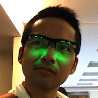

# 🆕 📱 📷 😀

New iPhone Camera Hack!

---
## 自己紹介

**@temoki**



* PL : エンジニア = 7 : 3
* iOS : Android = 9 : 1
* カメラ/写真 アプリ
* 雰囲気メガネ アプリ

---
## 新しい 📱 買いましたか？

---
## 📱 7 Plus + 艶々 JET BLACK

* 9月9日 16:01 予約受付開始
* 9月9日 16:07 予約できました
* 9月30日 いまだ処理中... 😭

---
## 今回の 📱 の個人的な目玉は...

---

## もちろんデュアルカメラ！
 二つのカメラが一つになって撮影します。

* より明るくなった広角カメラ F1.8 (28mm相当)
* 新しく加わった望遠カメラ F2.8 (56mm相当)

---
## デュアルで何が嬉しいのか？

* 📱 初の光学ズーム 2x
  * 👉 ~~デジタルズームと合わせて10x~~
* 二つのセンサー情報をフル活用したシーン認識
  * 👉 最適な写真を撮影
* ポートレートモード *※* での被写界深度エフェクト
  * 👉 一眼レフカメラのようなボケを表現

*※ パブリックベータ配信中の iOS 10.1 から利用可能*

---
## そして色再現

* 広色域キャプチャー
  * 👉 従来の sRGB より広い色空間の P3 で撮影
* 広色域ディスプレイ
  * 👉 True Tone ディスプレイで P3 色空間を再現

---
## これは、過去最強と言わざるをえない！

---
## 📱 ➓ 📷 🅰🅿♊️️

iOS 10 Camera API

---
## Camera API Diff

* **Dual Camera & Camera Discovery**
* **New Photo Capture API**
  * **RAW Format**
  * Live Photos
* Wide Color

---
## Dual Camera & Camera Discovery

---
## Dual Camera & Camera Discovery

* `AVCaptureDeviceDiscoverySession` *NEW!*

```swift
let session = AVCaptureDeviceDiscoverySession(
                deviceTypes: [.builtInDuoCamera],
                mediaType: AVMediaTypeVideo,
                position: .back)

let devices: [AVCaptureDevice]? = session?.devices
```

---
## Dual Camera & Camera Discovery

* `AVCaptureDeviceType` *NEW!*
  * `.builtInWideAngleCamera`
  * `.builtInTelephotoCamera`
  * `.builtInDuoCamera`

---
## 二つのカメラで同時キャプチャーできる！？

できたら被写界深度エフェクトみたいに、視差から立体認識してゴニョゴニョ...

---
## できません 😭

というのを確認する

---
## New Photo Capture API

---

## New Photo Capture API

* `AVCaptureStillImageOutput` *Deprecated*
* `AVCapturePhotoOutput` *NEW!*
  * **RAW Format Capture**
  * Live Photo Capture

---
## RAW Format

---

To be continued.
